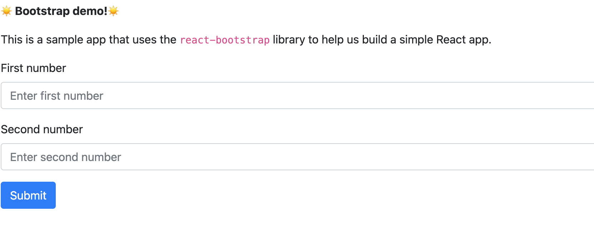
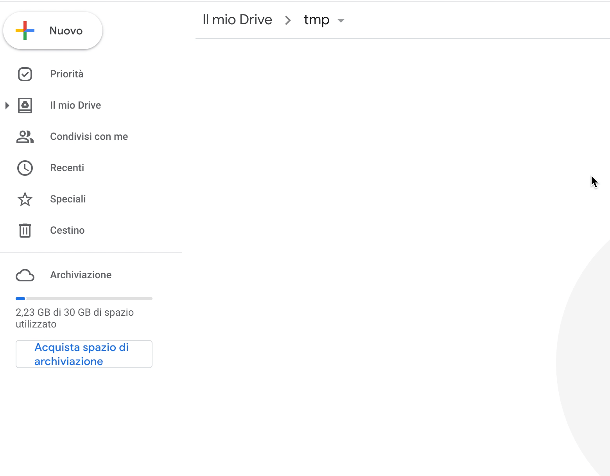

<p align="center">
  <a href="" rel="noopener">
 </a>
</p>

<div align="center">

[]()
[](https://github.com/delco97/React-GAS-Web-Template/issues)
[](https://github.com/delco97/React-GAS-Web-Template/pulls)
[](/LICENSE)
[](https://github.com/google/clasp)

</div>

<p align="center"> This is your boilerplate project for developing React web apps inside Google App Scripts (GAS).

If you want a boilerplate project for developing React apps inside Google Sheets, Docs, Forms and Slides projects please refer to: [React-Google-Apps-Script](https://github.com/enuchi/React-Google-Apps-Script).

This boilerplate was specifically developed starting from [React-Google-Apps-Script](https://github.com/enuchi/React-Google-Apps-Script) for React Web apps on GAS which requires some specific setups.


---

## 📝 Table of Contents

- [📝 Table of Contents](#-table-of-contents)
- [🔎 About <a name = "about"></a>](#-about-)
- [🚜 Install <a name = "install"></a>](#-install-)
  - [Prerequisites <a name = "prerequisites"></a>](#prerequisites-)
  - [🏁 Getting started <a name = "getting-started"></a>](#-getting-started-)
- [🚀 Deploy <a name = "deploy"></a>](#-deploy-)
- [🎈 [NEW!] Local Development - RECOMMENDED <a name="local-development"></a>](#-new-local-development---recommended-)
  - [🔍 Using React DevTools <a name="dev-tools"></a>](#-using-react-devtools-)
- [⛏️ Usage <a name = "Usage"></a>](#️-usage-)
  - [The included sample app](#the-included-sample-app)
  - [[New!] Typescript](#new-typescript)
  - [Adding packages](#adding-packages)
  - [Styles](#styles)
  - [Modifying scopes](#modifying-scopes)
  - [Calling server-side Google Apps Script functions](#calling-server-side-google-apps-script-functions)
  - [Autocomplete](#autocomplete)
- [✍️ Authors <a name = "authors"></a>](#️-authors-)
- [🎉 Acknowledgements <a name = "acknowledgement"></a>](#-acknowledgements-)

<br/>

## 🔎 About <a name = "about"></a>

[Google Apps Script](https://developers.google.com/apps-script/overview) is Google's Javascript-based development platform for building applications and add-ons for Google Sheets, Docs, Forms and other Google Apps.

You can add custom [user interfaces inside dialog windows](https://developers.google.com/apps-script/guides/html) and [web apps](https://developers.google.com/apps-script/guides/web), but the platform is designed for simple HTML pages built with [templates](https://developers.google.com/apps-script/guides/html/templates) and [jQuery](https://developers.google.com/apps-script/guides/html/best-practices#take_advantage_of_jquery).

However, using this repo, it's easy to run [React](https://reactjs.org/) apps inside a GAS web app, and build everything from small projects to advanced ones that can be published on the G Suite Marketplace.

This is really useful, for example, if you want ot build an admin console for your google account to expose custom UI to interact with your Google Services

<p align="center">
 
</p>

This repo is a boilerplate project that uses React and the same development tools that you use for building traditional websites, all inside Google Apps Script projects.

See below how to get started!

<br/>

## 🚜 Install <a name = "install"></a>

These instructions will get you set up with a copy of the React project code on your local machine. It will also get you logged in to `clasp` so you can manage script projects from the command line.

See [deploy](#deploy) for notes on how to deploy the project and see it live in a Google Spreadsheet.

### Prerequisites <a name = "prerequisites"></a>

- Make sure you're running at least [Node.js](https://nodejs.org/en/download/) v10 and `npm` v6.

- You'll need to enable the Google Apps Script API. You can do that by visiting [script.google.com/home/usersettings](https://script.google.com/home/usersettings).

- To use live reload while developing, you'll need to serve your files locally using HTTPS. See [local development](#local-development) below for how to set up your local environment.

### 🏁 Getting started <a name = "getting-started"></a>

**1.** First, let's clone the repo and install the dependencies.

```bash
git clone https://github.com/delco97/React-GAS-Web-Template.git
cd React-GAS-Web-Template
npm install
```


**2.** Next, we'll need to log in to [clasp](https://github.com/google/clasp), which lets us manage our Google Apps Script projects locally.

```bash
npm run login
```


**3.** Go to your google drive account and create an app script project. By default it will be created in your root folder.




Alternatively, you can use an existing Google App scrip project instead of creating a new one. **Important**: take in mind that content of the app script will be replace with the code produce by this boilerplate.

<details>
  <summary>See instructions here for using an existing app script project to deploy your app.</summary>

You will need to update the `.clasp.json` file in the root of this project with the following three key/value pairs:

```json
{
  "scriptId": "1PY037hPcy................................................",
  "rootDir": "./dist"
}
```

- `scriptId`: Your existing script project's `scriptId`. You can find it by opening your app script and selecting **Project settings**.

- `rootDir`: This should always be `"./dist"`, i.e. the local build folder that is used to store project files.

</details>

Next, let's deploy the app so we can see it live as a Google Web App.

<br/>

## 🚀 Deploy <a name = "deploy"></a>

Run the deploy command. You may be prompted to update your manifest file. Type 'yes'.

```bash
npm run deploy
```

The deploy command will build all necessary files using production settings, including all server code (Google Apps Script code), client code (React bundle), and config files. All bundled files will be outputted to the `dist/` folder, then pushed to the Google Apps Script project.

Now open the Google App Script project. You can also run `npm run open`. **Make sure to refresh the page if you already had it open**. Now you should see the code deployed on your GAS Web app

Run the `doGet` function in order to trigger the script to ask you the required permissions and allow them. **It's required only on your first deploy, or every time yor app need to access new google services.**


You are already set to start your development using npm run deploy each time you make some local updates. But this is a slow process. Take a look to the next section for a faster development setup (a lot faster!).


<br/>

## 🎈 [NEW!] Local Development - RECOMMENDED <a name="local-development"></a>

We can develop our client-side React apps locally, and see our changes live.


There are two steps to getting started: installing a certificate (first time only), and running the start command.

1. Generating a certificate for local development <a name = "generatingcerts"></a>

   Install the mkcert package:

   ```bash
   # mac:
   brew install mkcert

   # windows:
   choco install mkcert
   ```

   [More install options here.](https://github.com/FiloSottile/mkcert#installation)

   Then run the mkcert install script:

   ```bash
   mkcert -install
   ```

   Create the certs in your repo:

   ```
   npm run setup:https
   ```

2. Now you're ready to start:
   ```bash
   npm run start
   ```

The start command will create and deploy a development build, and serve your local files.

After running the start command, navigate to web app and open the verify deployment link to view the current code running. It should now be serving your local files. When you make and save changes to your React app, your app will reload instantly, and have access to any server-side functions!

When you ar done just stop the execution in your terminal (CTRL + C). You will se an error on the web page because you are not providing your local files to the app script. Just type npm run start to keep going with the development or just run npm run deploy to reset your setup to no-local development.

<br/>

### 🔍 Using React DevTools <a name="dev-tools"></a>

React DevTools is a tool that lets you inspect the React component hierarchies during development.

<details>
  <summary>Instructions for installing React DevTools</summary>

<br/>

You will need to use the "standalone" version of React DevTools since our React App is running in an iframe ([more details here](https://github.com/facebook/react/tree/master/packages/react-devtools#usage-with-react-dom)).

1. In your repo install the React DevTools package as a dev dependency:

   ```bash
   npm install -D react-devtools
   ```

2. In a new terminal window run `npx react-devtools` to launch the DevTools standalone app.

3. Add `<script src="http://localhost:8097"></script>` to the top of your `<head>` in your React app, e.g. in the [index.html](https://github.com/delco97/React-GAS-Web-Template/blob/e73e51e56e99903885ef8dd5525986f99038d8bf/src/client/dialog-demo-bootstrap/index.html) file in the sample Bootstrap app.

4. Deploy your app (`npm run deploy:dev`) and you should see DevTools tool running and displaying your app hierarchy.

   

5. Don't forget to remove the `<script>` tag before deploying to production.

</details>

<br/>

## ⛏️ Usage <a name = "Usage"></a>

### The included sample app

The included sample app allows to sum two number through a simple HTML page, built with React and the popular bootstrap library (in this case, it uses [`react-bootstrap`](https://react-bootstrap.github.io/)). This simple app demonstrates how a React app can interact with Google Apps Script functions. The example also contains a page built with typescript (see below)

### [New!] Typescript

This project now supports typescript!

To use, simply use a typescript extension in either the client code (.ts/.tsx) or the server code (.ts), and your typescript file will compile to the proper format.

Note that it is okay to have a mix of javascript and typescript, as seen in the Bootstrap demo.

To use typescript in server code, just change the file extension to .ts. The server-side code already utilizes type definitions for Google Apps Script APIs.

A basic typescript configuration is used here, because after code is transpiled from typescript to javascript it is once again transpiled to code that is compatible with Google Apps Script. However, if you want more control over your setup you can modify the included [tsconfig.json file](./tsconfig.json).

### Adding packages

You can add packages to your client-side React app.

For instance, install `react-transition-group` from npm:

```bash
npm install react-transition-group
```

Important: Since Google Apps Scripts projects don't let you easily reference external files, this project will bundle an entire app into one HTML file. This can result in large files if you are importing large packages. To help split up the files, you can grab a CDN url for your package and declare it in the [webpack file, here](./webpack.config.js#L157). If set up properly, this will add a script tag that will load packages from a CDN, reducing your bundle size.

### Styles

By default this project supports global CSS stylesheets. Make sure to import your stylesheet in your entrypoint file [index.js](./src/client/demo-bootstrap/index.js):

```javascript
import './styles.css';
```

Many external component libraries require a css stylesheet in order to work properly. You can import stylesheets in the HTML template, [as shown here with the Bootstrap stylesheet](./src/client/dialog-demo-bootstrap/index.html).

The webpack.config.js file can also be modified to support scss and other style libraries.

### Modifying scopes

The included app only requires access to loading windows. If you make changes to the app's requirements, for instance, if you modify this project to work with Google Forms or Docs, make sure to edit the oauthScopes in the [appscript.json file](./appsscript.json).

See https://developers.google.com/apps-script/manifest for information on the `appsscript.json` structure.

### Calling server-side Google Apps Script functions

This project uses the [gas-client](https://github.com/enuchi/gas-client) package to more easily call server-side functions using promises.

```js
// Google's documentation wants you to do this. Boo.
google.script.run
  .withSuccessHandler(response => doSomething(response))
  .withFailureHandler(err => handleError(err))
  .addSheet(sheetTitle);

// Poof! With a little magic we can now do this:
import Server from 'gas-client';
const { serverFunctions } = new Server();

// We now have access to all our server functions, which return promises!
serverFunctions
  .addSheet(sheetTitle)
  .then(response => doSomething(response))
  .catch(err => handleError(err));

// Or we can equally use async/await style:
async () => {
  try {
    const response = await serverFunctions.addSheet(sheetTitle);
    doSomething(response);
  } catch (err) {
    handleError(err);
  }
};
```

In development, `gas-client` will interact with [the custom Webpack Dev Server package](https://github.com/enuchi/Google-Apps-Script-Webpack-Dev-Server) which allows us to run our app within the dialog window and still interact with Google Apps Script functions.

### Autocomplete

This project includes support for autocompletion and complete type definitions for Google Apps Script methods.


All available methods from the Google Apps Script API are shown with full definitions and links to the official documentation, plus information on argument, return type and sample code.

<br/>

## ✍️ Authors <a name = "authors"></a>

- [@delco97](https://github.com/delco97) - Creator and maintainer

See the list of [contributors](https://github.com/delco97/React-GAS-Web-Template/contributors) who participated in this project.

<br/>

## 🎉 Acknowledgements <a name = "acknowledgement"></a>

Part of this project has been adapted from [React-Google-Apps-Script](https://github.com/enuchi/React-Google-Apps-Script), a great starter project for React based app for Google Sheets, Google docs, etc ([license here](https://github.com/enuchi/React-Google-Apps-Script/blob/master/LICENSE)).
